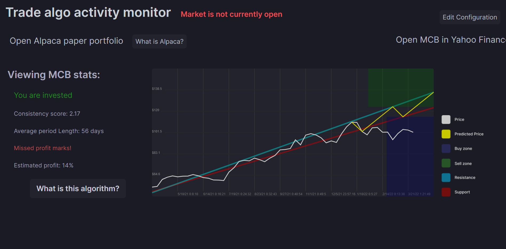

# BrokerBot
## An investment algorithm that trades paper stocks to maximize consistant profit

<br>

> ## This algorithm was designed to be used with a paper account (Simulated money), not real money
<br><br>

# Setup:
### You are going to need a computer to act as a server for the algorithm. You should also have one to view the web gui. This can be the same computer you are using as a server.
<br>

### 1) You must have [Node.js](https://nodejs.org) installed on the computer acting as a server.
<br>

### 2) You also need an alpaca paper trading account that this algorithm will use to place trades. Create one [here](https://app.alpaca.markets/signup).
<br>

### 3) Once on the Alpaca paper trading dashboard, click the ```Generate New Key``` button. Don't close this tab!
<br>

### 2) Download or clone this repo onto your server.
<br>

### 3) In your command promopt, cd into the folder.
<br>

### 4) Run ```node updateKeys.js```.

<br>

### 5) Navigate to ```http://localhost:3006``` in your web-browser and enter your keys from Alpaca. You can now close the Alpaca dashboard tab.
<br>

### 6) Run ```node index.js``` in your command prompt to start the algorithm, do this any time you want to restart it.
<br>

### If this is the first time running the program, you will have to wait for it to gather important data. This will take about 10-15 minutes. 
### (You will only have to do this the first time you run it, and every 2 weeks after that).
<br>

### 7) When this process has finished, the algorithm will start. Navigate to ```http://localhost:3006``` to view details about what the algorithm is doing.
<br>

### It should look something like this:


> ### Keep the server running, and let it carry out the trades in the background.
<br><br>

# What does this algorithm do?

> ## This algorithm looks at the past and current prices of a stock to try to determine when it will peak and drop.
<br><br>

### The server command prompt will give status reports every 15 minutes, when the market is open and every 30 when it is closed
<br><br>

## What does "Missed profit Marks" mean?
### When checking to see whether to buy, this algorithm compares the price to the next predicted dropoff.
### When checking to see whether to sell, this algorithm compares the price to the next predicted peak. 
<br>

### Typicly if the price of a stock falls bellow this buy threshold, it will cause the algorithm to detect a new peak and dropoff.
### However, this algorithm only updates the peaks and dropoffs once every 2 weeks. So if you get this message after it has invested, it means that either the algorithm has not updated yet, or the expected trend did not ocour.
### Don't worry if the expected trend never happened, because the algorithm will not update the data, it just means that the sell point will be lowered, only giving you half the expected profit. 
<br><br>

### If you are very worried that the stock you are invested in will suddenly, unexpectedly boom in price, loosing you potential profit, then you can force the algorithm to re-assess the stocks.

### To do this, you must set the ```timestamp``` property in ```data/configData.json``` to ```0``` and restart the server by pressing ```ctrl+c``` followed by ```node index.js``` in the command prompt.
<br>

---

<br>

## Find out more about how this algorithm evaluates stocks by clicking the ```What is this algorithm``` button